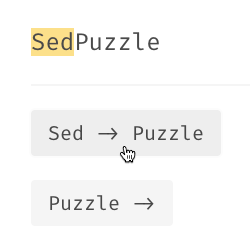

# s/Math + AI/ Reasoning in LLMs

This repository contains starter code in Python for PreCog's recruitment tasks. For more details, check the task doc.

# Documentation
## ``schema.py``
We define the data scheme using [Pydantic](https://docs.pydantic.dev/latest/) in ``schema.py``. This prevents any data validation problems. For the most part, you can treat it as a regular Python class that you can read from/write into JSON strings. We perform some basic validation checks to prevent invalid data being processed.
## ``utils.py``
- ``read_problem_folder()``/``read_solution_folder()``: Reads the corresponding JSON files and loads them as Python objects using Pydantic.
- ``write_problem_folder()``/``write_solution_folder()``:
Writes the problems/solutions to JSON files and saves them in the provided path.
- ``validate_solutions()``:
Takes in the problems and the provided solutions, and validates if the provided solution is correct for the given problem.

## ``baseline.py``
We implement a simple baseline that searches through the solution space until the empty string is reached. This is provided so that performance of LLM can be compared with traditional methods. You are free to improve it.

